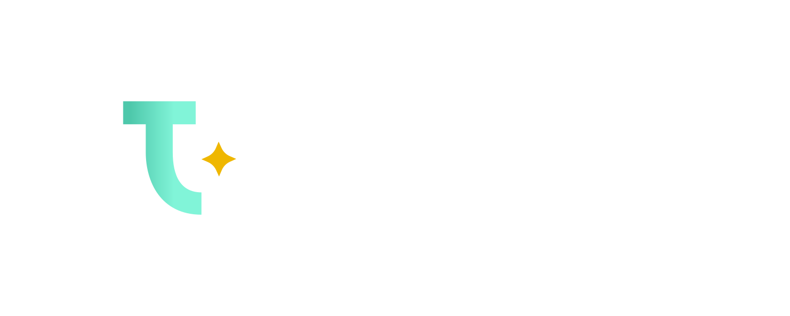

<p align="center">
  <a href="https://www.tigrisdata.com/"></a> 
</p>

<p align="center">
For developers who want to build scalable web and mobile apps fast!
</p>

<p align="center">
With a zero-ops scalable pub/sub messaging system and fault-tolerant 
cloud-native database, <br/> Tigris provides everything you need to get up and 
running quickly and efficiently.
</p>

<p align="center">
<a href="https://goreportcard.com/report/github.com/tigrisdata/tigris"> 

</a>
<a href="">

</a>
<a href="CODE_OF_CONDUCT.md">

</a>
</p>

<p align="center">
  <a href="https://www.tigrisdata.com/">Website</a> |
  <a href="https://docs.tigrisdata.com/quickstart/with-go">Quickstart</a> |
  <a href="https://docs.tigrisdata.com/apidocs/">API Reference</a> |
  <a href="https://join.slack.com/t/tigrisdatacommunity/shared_invite/zt-16fn5ogio-OjxJlgttJIV0ZDywcBItJQ">Slack Community</a> | 
  <a href="https://twitter.com/TigrisData">Twitter</a>
</p>

# Helpful Links

- [Key Concepts](https://docs.tigrisdata.com/overview/key-concepts)
- [Quickstarts](https://docs.tigrisdata.com/category/quickstart)
- [Data Modeling](https://docs.tigrisdata.com/category/data-modeling)
- [Guides](https://docs.tigrisdata.com/category/guides)
- [Client Library: Go](https://docs.tigrisdata.com/client-libraries/go)
- [Client Library: Java](https://docs.tigrisdata.com/client-libraries/java/overview)
- [Command Line Interface](https://docs.tigrisdata.com/cli)

# Community & Support

* [Slack Community](https://join.slack.com/t/tigrisdatacommunity/shared_invite/zt-16fn5ogio-OjxJlgttJIV0ZDywcBItJQ)
* [GitHub Issues](https://github.com/tigrisdata/tigris/issues)
* [GitHub Discussions](https://github.com/tigrisdata/tigris/discussions)

# Developing

### Building with Docker Containers

Start local Tigris server listening on `http://localhost:8081` by running:

```sh
make run
```

This would bring dependencies and server up in the docker containers with all
your changes.

### Running tests in docker containers

Tests are executed using `make test`. This runs both unit and integration
tests. The FoundationDB container auto-generates the cluster file which is
shared between containers using a docker volume.

The docker volume `fdbdata` is mounted at:

* /var/fdb/fdb.cluster in tigris_fdb container
* /etc/foundationdb/fdb.cluster in tigris_test and tigris_server containers,
  which is the default location where the client will search for the cluster
  file

You can run the test on your local machine as follows:

```shell
make osx_test
```

# License

This software is licensed under the [Apache 2.0](LICENSE).
